# 智趣项目 E-R 图（核心版）

这里保留核心业务表和几组最重要的关联表，重点展示主键、外键、状态和业务字段。完整 72 表模型仍保留在 [erd-zh-split.md](./erd-zh-split.md)。

## 01 核心业务总览

项目最重要的公共表：用户、课程内容、社区、社交、私聊、AI 会话和单机游戏。

Mermaid 源码：[01-core-overview.mmd](./erd-core/01-core-overview.mmd)

## 02 学习内容与奖励

课程目录、视频资源、测验、学习进度、经验值和成就。

Mermaid 源码：[02-learning-content.mmd](./erd-core/02-learning-content.mmd)

## 03 社区问答与社交

社区问题与回答的修订链、好友关系、私聊和通知。

Mermaid 源码：[03-community-social.mmd](./erd-core/03-community-social.mmd)

## 04 AI 助手与游戏

AI 助手记忆与推荐反馈、单机游戏进度，以及多人游戏房间核心表。

Mermaid 源码：[04-ai-and-games.mmd](./erd-core/04-ai-and-games.mmd)
