# 智趣项目 E-R 图（中文拆分版）

为便于阅读，完整数据库模型拆成 6 张图。用户表和学习内容表会在多个模块中重复出现，它们是跨模块关联的公共实体。

## 01 账号与内容目录

账号、登录令牌、用户偏好、课程分类、学习内容、标签、收藏与观看记录。

Mermaid 源码：[`01-account-content.mmd`](./erd-zh-split/01-account-content.mmd)

## 02 学习、测验与奖励

导师学习流程、视频资源、互动测验、学习进度、经验值与成就。

Mermaid 源码：[`02-learning-rewards.mmd`](./erd-zh-split/02-learning-rewards.mmd)

## 03 社区问答与内容安全

问题、回答、修订版本、标签、收藏、隐藏内容与安全审核。

Mermaid 源码：[`03-community.mmd`](./erd-zh-split/03-community.mmd)

## 04 社交、通知与私聊

社交资料、好友关系、屏蔽、游戏邀请、通知队列与私聊。

Mermaid 源码：[`04-social-chat.mmd`](./erd-zh-split/04-social-chat.mmd)

## 05 多人游戏

魔法、盲盒、谁是卧底、越狱游戏房间，以及大厅、邀请与安全检查。

Mermaid 源码：[`05-multiplayer-games.mmd`](./erd-zh-split/05-multiplayer-games.mmd)

## 06 AI 助手与单机游戏

AI 助手会话、消息、记忆、推荐反馈，以及四款单机游戏的实例、提交与进度。

Mermaid 源码：[`06-ai-single-player.mmd`](./erd-zh-split/06-ai-single-player.mmd)
